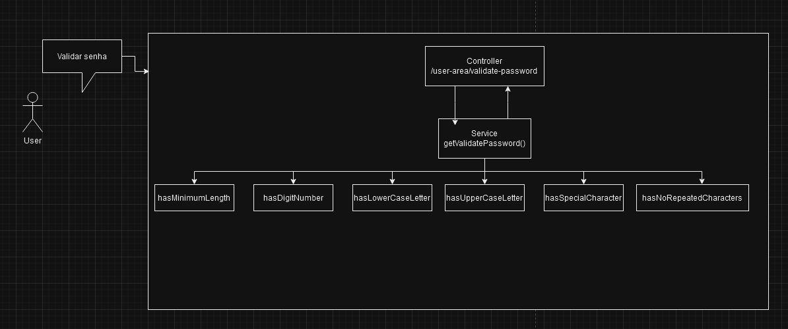

# validatorPassword


<a href="#-Estrutura-do-projeto">Estrutura do projeto</a>&nbsp;&nbsp;|&nbsp;&nbsp;
<a href="#-Pré-Requisitos">Pré-Requisitos</a>&nbsp;&nbsp;|&nbsp;&nbsp;
<a href="#-Preparando-o-ambiente">Preparando o ambiente</a>&nbsp;&nbsp;|&nbsp;&nbsp;

Neste módulo é possível realizar as seguintes ações:

* Validar se a senha do usuário é uma senha segura


## 🛠 Estrutura do projeto

A estrutura deste projeto foi inspirada nas propostas
de [Arquitetura MVC](https://medium.com/@celionormando/arquitetura-mvc-e-princ%C3%ADpios-de-projeto-3d0b278ef910)

## ✔ Pré-Requisitos

* [Java Open JDK 17](https://openjdk.org/projects/jdk/17/)
* [Maven](https://maven.apache.org/download.cgi)


## 💻 Preparando o ambiente

1. Clone o projeto
```
git clone git@github.com:jaquelinecavalaro/validatorPassword.git
```

2. Instale as dependências do `pom.xml` (Maven)
```
mvn clean install -U
```

### Iniciar a aplicação
```
mvn spring-boot:run
``` 

Após executar o script você poderá acessar os
endpoints pelo endereço: http://localhost:8090/swagger-ui/index.html#

Lembre-se de pegar a chave gerada em seu console para realizar o acesso.

### Rodar teste de mutação
```
mvn org.pitest:pitest-maven:mutationCoverage
``` 
### Desenho da arquitetura

